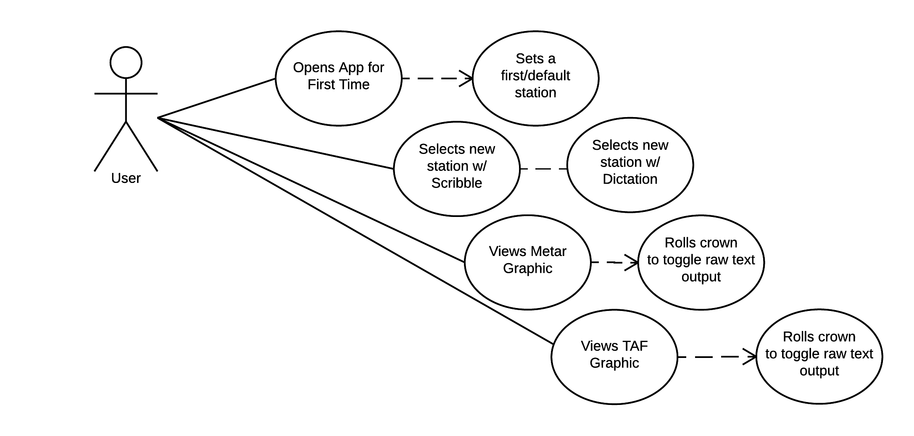

# Use Case Model

<!-- *This is the template for your use case model. The parts in italics are concise explanations of what should go in the corresponding sections and should not appear in the final document.* -->

**Author**: Matthew Hull

## 1 Use Case Diagram

<!-- *This section should contain a use case diagram with all the actors and use cases for the system, suitably connected.* -->

## 2 Use Case Descriptions

<!--
*For each use case in the use case diagram, this section should contain a description, with the following elements:*

- *Requirements: High-level description of what the use case must allow the user to do.*
- *Pre-conditions: Conditions that must be true before the use case is run.*
- *Post-conditions Conditions that must be true once the use case is run.*
- *Scenarios: Sequence of events that characterize the use case. This part may include multiple scenarios, for normal, alternate, and exceptional event sequences. These scenarios may be expressed as a list of steps in natural language or as sequence diagrams.*
-->

#### Opens App for First Time
* Requirements: When no default is chosen, the app will display a default station
* Pre-conditions: The app is being opened for the first time.
* Post-conditions: If no default is chosen, the default station will be displayed the next time that the user opens the app, else the previously selected default station will be displayed when the user opens the app.
* Scenarios:
 	* Normal: The app is opened for the 1st time and it retrieves the METAR for the default station. The user then proceeds to use case 'Views Metar Graphic' or use case 'Views TAF Graphic' and sets a default station.
 	* Alternate: The app is opened for the 1st and it retrieves the METAR for the default station. The user then sets the current default station as the default station.
 	* Exceptional: The app is opened for the 1st time and a data connection isn't available.  An alert will be displayed to notify the user, however default static data may be displayed to hint at the UI's appearance.

#### Views Metar Graphic
* Requirements: The app will display the METAR report for a selected station.
* Pre-conditions: The user has selected a valid station.
* Post-conditions: The METAR for the selected section is displayed in a graphical format.
* Scenarios:
	* Normal: The METAR is retrieved and the values are interpreted to matcing graphics for the existing conditions.
	* Normal: 
	* Exceptional: The METAR is requested without a data connection - an alert will be displayed to the user.

#### Views TAF Graphic
* Requirements: The app will display the TAF report for a selected station.
* Pre-conditions: The user has selected a valid station.
* Post-conditions: The TAF for the selected section is displayed in a graphical format.
* Scenarios:
	* Normal: The TAF is retrieved and the values are interpreted to matching graphics for teh existing 
	* Alternate:
	* Exceptional:

#### Selects new station w/ Scribble [or Dictation]
* Requirements:
* Pre-conditions:
* Post-conditions:
* Scenarios:
	* Normal:
	* Alternate:
	* Exceptional:

<!--
#### Use Case Title
* Requirements:
* Pre-conditions:
* Post-conditions:
* Scenarios:
	* Normal:
	* Alternate:
	* Exceptional:
-->
