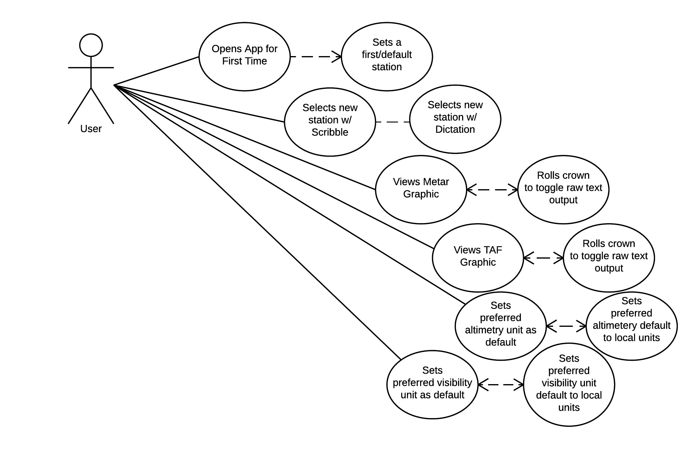

# Use Case Model

<!-- *This is the template for your use case model. The parts in italics are concise explanations of what should go in the corresponding sections and should not appear in the final document.* -->

**Author**: Matthew Hull

## 1 Use Case Diagram

<!-- *This section should contain a use case diagram with all the actors and use cases for the system, suitably connected.* -->

## 2 Use Case Descriptions

<!--
*For each use case in the use case diagram, this section should contain a description, with the following elements:*

- *Requirements: High-level description of what the use case must allow the user to do.*
- *Pre-conditions: Conditions that must be true before the use case is run.*
- *Post-conditions Conditions that must be true once the use case is run.*
- *Scenarios: Sequence of events that characterize the use case. This part may include multiple scenarios, for normal, alternate, and exceptional event sequences. These scenarios may be expressed as a list of steps in natural language or as sequence diagrams.*
-->

#### Opens App for First Time
* Requirements: When no default is chosen, the app will display a default station
* Pre-conditions: The app is being opened for the first time.
* Post-conditions: If no default is chosen, the default station will be displayed the next time that the user opens the app, else the previously selected default station will be displayed when the user opens the app.
* Scenarios:
 	* Normal: The app is opened for the 1st time and it retrieves the METAR for the default station. The user then proceeds to use case 'Views Metar Graphic' or use case 'Views TAF Graphic' and sets a default station.
 	* Alternate: The app is opened for the 1st and it retrieves the METAR for the default station. The user then sets the current default station as the default station.
 	* Exceptional: The app is opened for the 1st time and a data connection isn't available.  An alert will be displayed to notify the user, however default static data may be displayed to hint at the UI's appearance.

#### Selects new station w/ Scribble [or Dictation]
* Requirements: The user can select any valid station to view a METAR or TAF.
* Pre-conditions: The user has selected to enter a new station.
* Post-conditions: The app will display the METAR or TAF for the current station.
* Scenarios:
	* Normal: The user selects a valid station via text entry.
	* Alternate: The user selects a valid station via dictation.
	* Exceptional: The user selects an invalid station. An alert will be displayed to the user.

#### Views Metar Graphic
* Requirements: The app will display the METAR report for a selected station.
* Pre-conditions: The user has selected a valid station.
* Post-conditions: The METAR for the selected section is displayed in a graphical format.
* Scenarios:
	* Normal: The METAR is retrieved and the values are interpreted to matcing graphics for the existing conditions.
	* Alternate: The METAR is retrieved and values are displayed in raw text when the user scrolls the crown.
	* Exceptional: The METAR will be displayed with an alert when the report is more than one hour old.
	* Exceptional: The METAR is requested without a data connection - an alert will be displayed to the user.

#### Views TAF Graphic
* Requirements: The app will display the TAF report for a selected station.
* Pre-conditions: The user has selected a valid station.
* Post-conditions: The TAF for the selected section is displayed in a graphical format.
* Scenarios:
	* Normal: The TAF is retrieved and the values are interpreted to matching graphics for the existing conditions.
	* Alternate: The TAF is retreieved and the values are displayed in raw text when the user scrolls the crown.
	* Exceptional: The TAF will be displayed with an alert when the forecast is expired.
	* Exceptional: The TAF is requested without a data connection - an alert will be displayed to the user.

#### Sets Preferred Altimetry Unit as Default
* Requirements: The altimetry output default may be in: inHg or hPa or a local default where the reported unit is reported without conversion.
* Pre-conditions: A METAR or TAF report has been retrieved.
* Post-conditions:  The METAR or TAF altimeter value is displayed according to the preference stored in the defaults.
* Scenarios:
	* Normal: The altimetry value is displayed and not converted. This demonstrates the 'local units' setting.  i.e., in the U.S., the value would be returned as InHg units and in HPa units in Europe.
	* Alternate: The altimetry value is converted as needed and displayed in InHg.
	* Alternate: The altimetry value is converted as needed and displayed in HPa.

#### Sets Preferred Visibility Unit as Default
* Requirements: The visibility output  default may be in meters or statue miles.
* Pre-conditions: A METAR or TAF report has been retrieved.
* Post-conditions: The METAR or TAF visibility value is displayed according to the preference stored in the defaults.
* Scenarios:
	* Normal: The visibility value is displayed and not converted. This demonstrates the 'local units' setting.  i.e., in the U.S., the value would be returned as statue miles (SM) and in meters in Europe.
	* Alternate: The visibility value is converted as needed and displayed in SM.
	* Alternate: The visibility value is converted as needed and displayed in meters.

<!--
#### Use Case Title
* Requirements:
* Pre-conditions:
* Post-conditions:
* Scenarios:
	* Normal:
	* Alternate:
	* Exceptional:
-->
